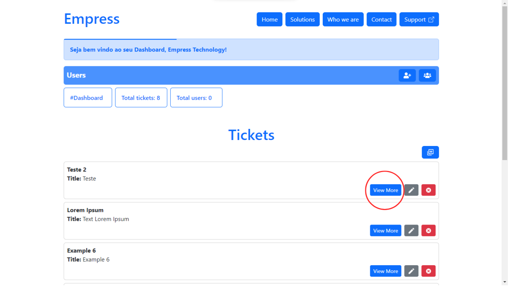

<h1 align="center" name="readme-top"> Sistema de gerenciador de tickets </h1>

  

  
Índice

  <ol>
    <li><a href="#descrição-do-projeto">Descrição do Projeto</a></li>
    <li><a href="#funcionalidades-e-demonstração-da-aplicação">Funcionalidades e Demonstração da Aplicação</a></li>
    <li><a href="#acesso-ao-projeto">Acesso ao Projeto</a></li>
    <li><a href="#tecnologias-utilizadas">Tecnologias utilizadas</a></li>
    <li><a href="#autores">Autores do Projeto</a></li>
    <li><a href="#desenvolvedores">Desenvolvedores do projeto</a></li>
    <li><a href="#licença">Licença</a></li>
  </ol>

# 
 Descrição do Projeto 

 Sistema web de gerenciamento de tickets com opção de cadastro de usuários e suporte remoto ao usuário via link disponível para contato.

# 
 :hammer: Funcionalidades do projeto 

- Tutorial de utilização do sistema

1. Somente usuários autenticados poderão utilizar o sistema para registrar, editar o excluir tickets/usuários, clique no botão support e siga os próximos passos.

 
   

<a href="#readme-top">Voltar ao topo</a>

2. Selecione se precisará de suporte ou se é um administrador, se precisar de suporte será redirecionado para o link whatsapp do nosso suporte, se for administrador do sistema siga para o próximo passo.

 
   

<a href="#readme-top">Voltar ao topo</a>

3. Faça login com uma conta de administrador:

- `Login: contact@empress.com` 
- `Password: 123456`

 
   

- O sistema irá listar todos os usuário e tickets do sistema, suas informações, opções de criar, editar e excluir.

<a href="#readme-top">Voltar ao topo</a>

5. Possivel registrar novos usuários do sistema, necessário ser criado por outro usuário e estar autenticado, todas as senhas são criptografadas no banco de dados.

 
   

<a href="#readme-top">Voltar ao topo</a>

6. Na seção `Users` é possível listar, editar e excluir usuários cadastrados no sistema.

 
   

<a href="#readme-top">Voltar ao topo</a>

7. Botão de criação de `ticket`.

 
   

- Página de criação de `tickets`

 
   

<a href="#readme-top">Voltar ao topo</a>

8. Em <strong>tickets</strong> é possível ver mais informações do ticket em `View More`.

 
   

<a href="#readme-top">Voltar ao topo</a>

9. Em <strong>tickets</strong> é possível `editar` e `excluir` os tickets.

 
   

<a href="#readme-top">Voltar ao topo</a>

# 
 :file_folder: Acesso ao Projeto 

Você pode acessar o sistema clicando [aqui,](https://empresstechnology.onrender.com/) ou se preferir, digitando em seu navegador o link abaixo.

`https://empresstechnology.onrender.com/`

<a href="#readme-top">Voltar ao topo</a>

# 
 :heavy_check_mark: Tecnologias Utilizadas 

- `ReactJS`
- `Javascript`
- `Bootstrap`
- `React Router`
- `MongoDB`
- `Express.js`
- `Criptografia bcryptjs`
- `JOI`

<a href="#readme-top">Voltar ao topo</a>

# 
 Autores 

[ Mikaelisson Gesuino](https://github.com/Mikaelisson)
| :---: |

[ Henrique Portes](https://github.com/Henrique-Portes)
| :---: |

[ Matheus Mattos](https://github.com/Pzzinho)
| :---: |

<a href="#readme-top">Voltar ao topo</a>

# 
 Desenvolvedores do Projeto 

[ Mikaelisson Gesuino](https://github.com/Mikaelisson)
| :---: |

# 
 Licença 

The [MIT License]() (MIT)

